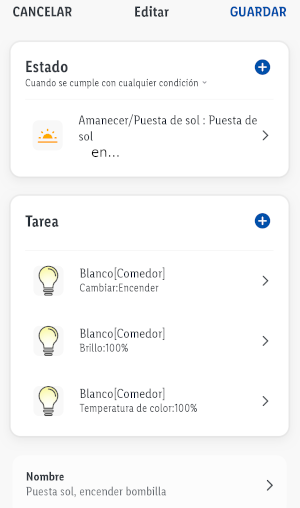

# Domótica para Dummies. Empezando con el kit de LIDL Smart Home
### Componentes: 
- Silvercrest Central domotica. Model HG06339.
- Silvercrest Sensor movimiento. Model HG06335. 1 x Pila CR123A 3V.
- Silvercrest Enchufe inteligente. Model HG06337.
- Silvercrest Sensor para puertas y ventanas. Model HG06336. IP21. 2 x Pilas AAA.
- LivarnoLux Cinta con leds 2m. Model HG06336. HG06336.
- LivarnoLux Bombilla Led E27 9W 806 lm 2200-6500K. A+. Model HG06492C.
- Lidl Home de Google Play.
- Integración con Google Home.
- Zigbee certified.

### Instalación APP Lidl Home

- [GooglePlay: LIDL HOME](https://play.google.com/store/apps/details?id=com.lidlhome.smart&hl=en)

Una vez emparejados los elementos con el Gateway Zigbee. Empezaremos realizando unas acciones tipo `Pulse para Ejecutar`.

### Smart Actions `Pulse para Ejecutar`:

1. Ejemplo: Bombilla ON

1. Ejemplo: Bombilla OFF

1. Ejemplo: Leds ON

1. Ejemplo: Leds OFF

1. Resumen acciones.

### Automatizaciones Smart `Pulse para Ejecutar`:

1. Ejemplo: Apagar bombilla a los 3 minutos de encenderse.

1. Ejemplo: Encender bombilla en puesta de sol.

1. Ejemplo: Si movimiento encender bombilla en 1s.

